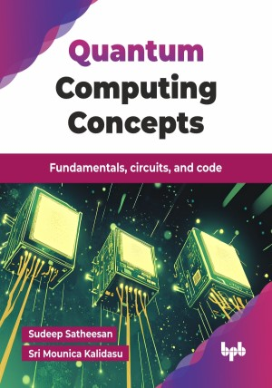

# Quantum Computing Concepts

Fundamentals, circuits, and code.

This is the repository for [Quantum Computing Concepts
](https://bpbonline.com/products/quantum-computing-concepts?variant=44728814403784),published by BPB Publications.

## About the Book
Quantum computing is redefining computational boundaries, offering solutions to complex problems that classical computing struggles to address. A deep understanding of quantum principles, algorithms, and practical tools is essential for professionals and researchers navigating this transformative technology. Quantum computing is no longer a distant dream—it is rapidly becoming a cornerstone of modern innovation.

This book provides a structured introduction to quantum computing, covering foundational principles such as superposition and entanglement, quantum gates, and circuits. Readers will gain hands-on experience with Qiskit and IBM Q, explore quantum error correction, and understand the real-world applications of quantum computing across industries. Alongside theoretical concepts, readers are introduced to hands-on quantum programming using Qiskit and IBM Q. The book also addresses practical challenges like quantum error correction and showcases real-world applications across industries, including cybersecurity, artificial intelligence, and material science. 

By the end of this book, readers will have a solid grasp of quantum computing fundamentals and hands-on experience with practical tools. Equipped with both conceptual understanding and hands-on experience, readers will be prepared to contribute meaningfully to research, solve industry-relevant problems, and engage confidently with the rapidly evolving field of quantum computing.

## What You Will Learn
• Grasp fundamental quantum principles for quantum computing applications.  

• Learn the differences between classical and quantum computing architectures.  

• Understand quantum gates, Bloch sphere, matrices, and Kronecker product for circuit design.

• Hands-on experience with Qiskit and IBM Q for simulations.  

• Explore key quantum algorithms like Grover's, Shor's, Bernstein-Vazirani, and QPE.

• Discover quantum computing's transformative applications across various industries.  
